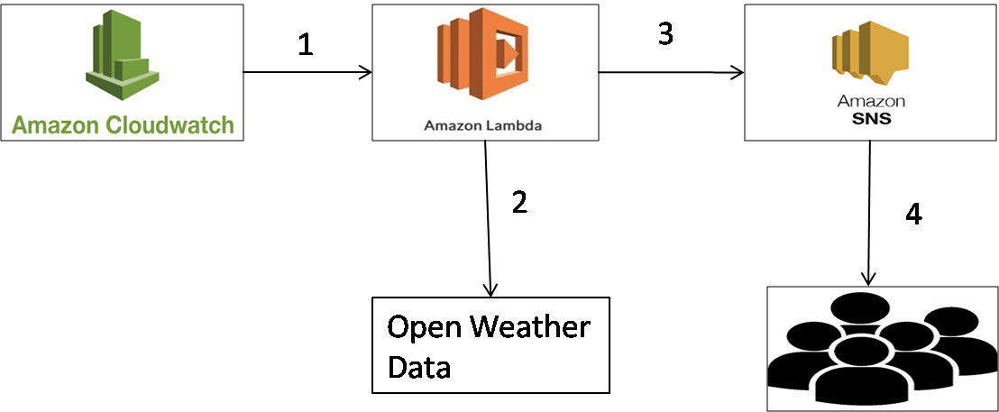

# Real-time-rain-forecast
## Real time weather forecast using AWS and Open weather API

Being from a village in southern part of India with agricultural background, we are always dependent on rain for a different number of reasons. Thanks to internet, it is now easy to get real-time predictions for rain/weather forecasts. However for people without any smart phones and internet access (which is common in our village), having an sms based alert about forecasted rain in near real-time will be a extremely helpful.

Having recently completed AWS Certified Solutions Architect exam and gaining access knowledge about a plethora of AWS services, I was extremely impressed with the opportunities it provides. In particular, AWS Lambda seems to be a game changer enabling Serverless computing. So based on my recently accumulated knowledge in AWS and also exposure to "openweathermap" I decided to come up with a solution to provide sms based alert about rain prediction in near real-time using AWS technologies like Lambda, SNS and Cloudwatch event.

Real-time Rain forecast using AWS Lambda , AWS SNS  & Open Weather

## Technical architecture:
The core part of this solution is an AWS Lambda function written in Python code which uses OpenWeather API to get the the weather forecast for the next few hours for a particular location/city. The lambda function parses the json object returned by the api call and then checks if there is a rain forecast. In case of a rain forecast, it sends rain forecast message (with additional details such as when is the rain forecasted and what is the volume of rain in mm) to an SNS topic which then sends the alerts as sms messages to mobile phones!

1. Cloudwatch triggers lambda at  scheduled intervals.
2. Lambda function executes and calls Open Weather API to extract rain forecast data.
3. Lambda function publishes rain alert to SNS topic.
4. scribed SNS customers get real time rain forecast alert on their mobile phone through SMS.

